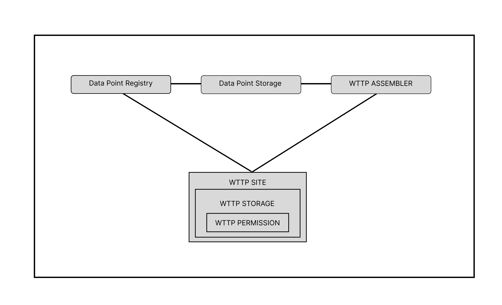

# WTTP Architecture
        

The Web3 Transfer Protocol (WTTP) architecture leverages blockchain-based smart contracts to provide a decentralized system for storing, retrieving, and managing web resources. It is built on top of the **EVM Storage Protocol** and **WTTP Protocol**, working together seamlessly to handle content addressing, permissions, royalties, and efficient storage mechanisms.

---

## EVM Storage Protocol

The **EVM Storage Protocol** serves as the foundational layer of WTTP. It consists of two main contracts: 

1. **DataPointStorage**: Manages the storage and retrieval of data points.
2. **DataPointRegistry**: Registers data points and calculates royalties for their use.

### Key Components

- **DataPointStorage Contract**:

    - **Structures**:
        - `DataPoint`: Made up of a `DataPointStructure` and the actual data.
        - `DataPointStructure`: Contains:
            - `mimeTypes; bytes2`
            - `charSet; bytes2`
            - `location; bytes2`
    - **Functions**:
        - `writeDataPoint`: Writes data to storage.
        - `readDataPoint`: Retrieves data from storage.
        - `calculateDataPointAddress`: Generates a unique address using the hash of predefined variables.

- **DataPointRegistry Contract**:
    Allows writing data points to the storage while managing royalty calculations. Ensures publishers collect royalties when their data is reused by others.

       - **DATA POINT ROYALTY**:
        - `DataPoint`: Made up of a `DataPointRoyalty` and the actual data.
        - `DataPointRoyalty`: Contains:
            - `Gas Used`
            - `Publisher`
    - **Functions**:
        - `getRoyalty view (bytes32)`: Calculates the royalty amount for a data point.
        - `writeDataPoint payable (tuple,address)`: Writes a new data point and handles royalty logic.
        - `royaltyBalance view (address)`: Checks the royalty balance of a publisher
    

### Summary

The EVM Storage Protocol introduces:

- A robust **content-addressed storage mechanism**.
- A **royalty system** to incentivize data creation and reuse.

---

## WTTP Site

The **WTTP Site** utilizes the EVM Storage Protocol, introducing HTTP-like methods on the smart contract. It integrates **storage management**, **permissions**, and **resource retrieval**.

### Key Contracts

The `WTTP Site` contract consist of the `WTTP Storage` contract which consist of the `WTTP Permission` contract.

1. **WTTP Site Methods**:

    - Implements HTTP-like methods, including:
        - `PATCH`
        - `PUT`
        - `HEAD`
        - `LOCATE`
        - `DELETE`
        - `DEFINE`
        - `OPTIONS`
        - `TRACE`

2. **WTTP Storage Contract**:

    - Extends the permissions contract.
    - Provides core storage functions such as:
        - `writeHeader`: Writes metadata for a resource.
        - `deleteResource`: Deletes a stored resource.
        - `readLocation`: Retrieves the location of a resource.
        - `readHeader`: Reads resource metadata.
        - `updateResource`: Updates an existing resource.
        - `createResource`: Creates a new resource.

3. **WTTP Permissions Contract**: WTTP Permission contract is a modified version of openzepplin's Access Control contract.
       - Provides permission functions such as:
          - `createResource`: Creates a new resource.
          - `createResourceRole nonpayable (string)` : Creates a resource specific admin role.
        

---

## WTTP Assembler

The **WTTP Assembler** reads information from the `WTTP Sites` and uses the `Datapoint Storage` contract to assemble `GET` requests made by a WTTP handler.

1. **WTTP Assembler Methods**:

    - Implements HTTP-like methods, including:

        - `HEAD`
        - `LOCATE`
        - `GET`
        - `OPTIONS`
        - `TRACE`
   
Note: **WTTP Assembler Methods** uses just read-only functions.

### WTTP Requests
All WTTP assembler methods require a wttp site address to perform this request. The `WTTP Assembler` contract will assemble data from any compatible `WTTP Site`.

### Key Functionality

- **HEAD Method**:
    - Returns metadata about the request.
      1. This method is similiar to the `HTTP HEAD` method.
      2. This Access data from the requested `WTTP Site` contract.

- **LOCATE Method**:
    - Retrieves an array of data point address of the requested resource.
       1. This Access data from the requested `WTTP Site` contract.

- **GET Method**:
    - Retrieves data by:
      1. Using locate method to locate data point addresses from the `WTTP Site` contract.

    - Handles resource assembly by combining data from all data points. 
     1. This Access data from the requested `WTTP Site` and `Datapoint Storage` contract.

- **OPTION Method**:
    - Returns metadata about the request.
      1. This method is similiar to the `HTTP OPTION` method.
      2. This Access data from the requested `WTTP Site` contract.

- **TRACE Method**:
    - Returns metadata about the request.
      1. This method is similiar to the `HTTP OPTION` method.
      2. This Access data from the requested `WTTP Site` contract.

---

## How It Works

1. **Data Storage**:
    - Data points are stored on the blockchain through the `DataPointStorage` contract.
    - Each data point has a unique address calculated using its structure and metadata.

2. **Royalties**:
    - When a user writes data via the `DataPointRegistry`, royalty calculations ensure that the original publisher gets compensated for reuse.

3. **Permissions and Roles**:
    - Role-based permissions are enforced through the `WTTP Permissions` contract.

4. **Resource Management**:
    - HTTP-like methods allow users to create, update, and delete resources.

---

## Integration of WTTP and EVM Storage Protocol

The WTTP Protocol interacts seamlessly with the EVM Storage Protocol:

- The `GET` method in WTTP retrieves resource location from the `WTTP Site`contract.
- It fetches the actual data from `DataPointStorage` and assembles the content.
- This interaction ensures efficient data storage and retrieval.

---

## Planned Enhancements 

The WTTP Protocol is under active development, with future updates planned:

  -  Implementing `OPTIONS` and `TRACE` HTTP-like methods.
  -  Optimizing royalty calculations.
  -  Enhancing data assembly mechanisms for larger resources.

---

# Data Management Features

1. **Content-Addressed Storage**:
    WTTP uses content-addressed storage, meaning each data point is uniquely identified by its hash. This ensures the integrity and authenticity of the stored content, as the hash of the content determines its storage location.

2. **Chunked Storage**:
    For large resources, WTTP supports chunked storage. Large files are broken down into smaller, manageable chunks and stored separately. This ensures efficient data storage, retrieval, and duplication management.

3. **Range Requests**:
    For large files, the GET and PUT methods support range requests, allowing you to request or send specific byte ranges of a resource. This is useful for handling large files without overloading the network or requiring complete file transfers.

4. **ETags and Conditional Requests**:
    WTTP supports ETags (entity tags) to manage resource versioning and caching. This allows clients to make conditional requests and only download resources that have changed since the last request.

5. **Multi-Part Resources**:
    WTTP supports multi-part resources, allowing the upload and management of complex, multi-section files. This is especially useful for large documents or media files.

6. **Cache Control**:
    The protocol supports cache control headers to manage caching behavior and resource expiration. This ensures efficient use of bandwidth and helps prevent unnecessary downloads of unchanged content.

# Permissions and Roles

1. **Role-Based Access Control (RBAC)**:
   WTTP supports role-based access control, allowing different users to have different levels of access to resources. Key roles include:
     - **Owner**: Full control over the site, including admin management and permissions.
     - **Site Admin**: Full control over the site, including resource management and permissions.
     - **Resource Admin**: Ability to upload and manage resources.
     - **Viewer**: Read-only access to view content.

2. **Granular Permission Management**:
   WTTP allows for granular permission management, which means you can assign specific permissions for individual resources. For example, you can allow one user to edit a resource and another user to only view it.

# Royalty System

1. **Gas-Based Royalties**:
    WTTP incorporates a royalty system where publishers and site owners can earn royalties based on the gas used in resource creation. This ensures that creators can monetize their decentralized content.

2. **Fee Distribution**:
    A portion of each transaction's fee is distributed to the platform, with a standard distribution of 10% to the TW3 platform and 90% to the publisher. 

3. **Waiver Options**:
    Publishers can opt-out of royalties or waive them for specific transactions, providing flexibility for different use cases. When publishers opt out tw3 also opts out of the fee in the name of opensource.

## Conclusion

The WTTP architecture demonstrates the power of blockchain-based protocols for decentralized web resource management. By combining the EVM Storage Protocol and WTTP, the system ensures secure, efficient, and incentivized data handling for Web3 applications.

For further questions, feel free to reach out or leave a comment. Thank you!